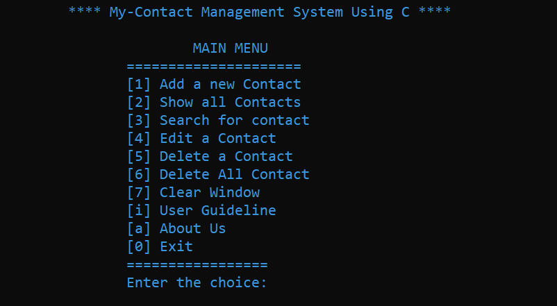

<h1>Contact Management System In C</h1>

	contact management system is a system where you can store your all contact information, you can edit and delete the contact number also you can search contact information. That means it is a way to manage your contact information.

