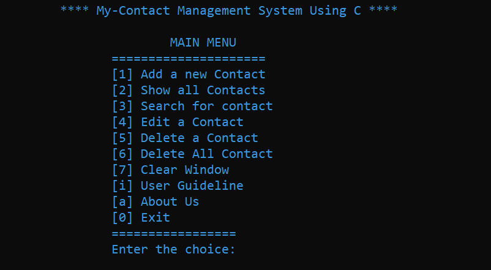
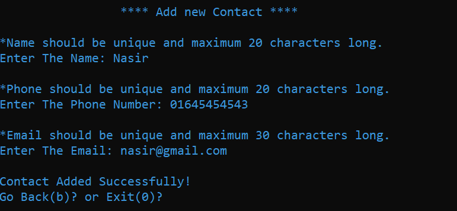
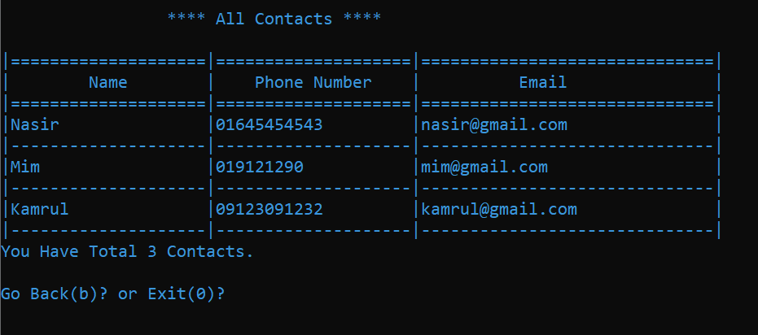
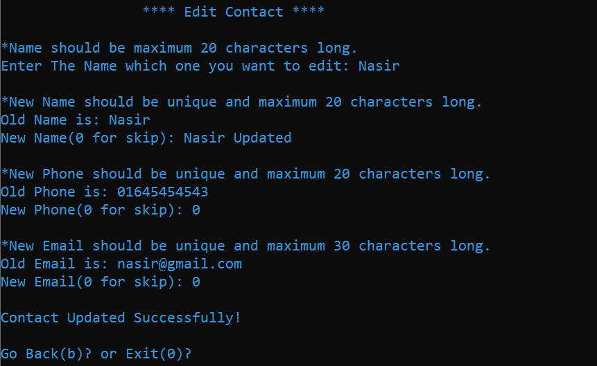
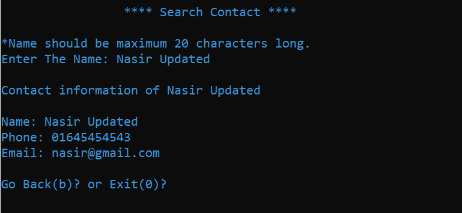

<h1>Contact Management System In C</h1>

	contact management system is a system where you can store your all contact information, you can edit and delete the contact number also you can search contact information. That means it is a way to manage your contact information.

Read the full documentation to learn <a href="https://insidethediv.com/contact-management-system-program-in-c" target="_blank">how to crate a menu for contact management system</a>.

Read the full documentation to learn <a href="https://insidethediv.com/contact-management-system-program-in-c" target="_blank">how to add a new contact in a contact management system</a>.

Read the full documentation to learn <a href="https://insidethediv.com/contact-management-system-program-in-c" target="_blank">how to add a new contact in a contact management system</a>.

Read the full documentation to learn <a href="https://insidethediv.com/contact-management-system-program-in-c" target="_blank">how to edit a new contact in a contact management system</a>.

Read the full documentation to learn <a href="https://insidethediv.com/contact-management-system-program-in-c" target="_blank">how to searcg a new contact in a contact management system</a>.

<mark>Watch The Full <a href="https://www.youtube.com/embed/qryAyBxOzPg">Video</a> For better understanding</mark>

